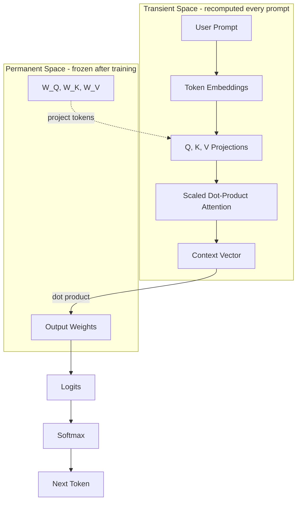
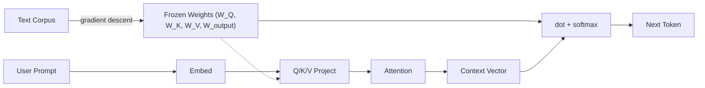

# The Magic Pipeline: How a Frozen Brain Looks Like It's Thinking

Stripping away the raw Python syntax actually makes the mechanics of the illusion much clearer. Without syntax getting in the way, we can look directly at the math and logic that turns cold, frozen numbers into something that feels like an active mind.

What follows is the architectural breakdown of the "Magic Pipeline" — pure logic, pseudocode, worked examples, and a straight line back to the runnable code in [demo.py](demo.py).

---

## 1. The Two-System Architecture

An LLM operates on a strict division of labor between two systems:

1. **Transient Space (the context window and attention).** A blank, fluid canvas. Active memory that recalculates relationships from scratch every single time you press enter. It handles the *now*.
2. **Permanent Space (the frozen weights).** A massive, unchanging grid of pre-trained knowledge. It does not adapt to your prompt; it is completely static.

The illusion happens because the **Transient Space** dynamically warps your prompt based on context, steering it into different lanes of the **Permanent Space**.



---

## 2. The Pipeline Logic

### The mathematical framework

Each token is embedded as a vector. To figure out context, the model projects every token through three learned weight matrices (Q, K, V), then computes attention scores:

$$Score_{ij} = \frac{Q_i \cdot K_j}{\sqrt{d_k}}$$

These scores pass through softmax to become weights that sum to 1.0, then the model blends the Value vectors:

$$Context_i = \sum_{j} \text{softmax}(Score_{ij}) \times V_j$$

### The pipeline

```text
FUNCTION Run_Inference(User_Prompt):

    STEP 1: EMBED
        For each token in User_Prompt:
            Look up its embedding vector from the embedding table.
        (Tokens are isolated points — they don't know their neighbors yet.)

    STEP 2: PROJECT (Q, K, V)
        For each token embedding x:
            Query  = W_Q · x
            Key    = W_K · x
            Value  = W_V · x
        (Three different linear projections of the same input.)

    STEP 3: ATTEND
        From the prediction position (last token):
            For each position j:
                score_j = dot(Query_last, Key_j) / sqrt(d)
            attention_weights = softmax(scores)
        (The model decides which tokens matter for the prediction.)

    STEP 4: BLEND
        context = sum(attention_weight_j * Value_j)
        (A single vector that encodes the contextual meaning of the full prompt.)

    STEP 5: SCORE OUTPUT CANDIDATES
        For each candidate token in the frozen output weights:
            logit = dot(context, output_weights[candidate])
        probabilities = softmax(logits)
        RETURN chosen next token
```

> **The Q/K/V mechanism is the core of attention.** The Query asks "what am I looking for?", the Key advertises "what do I contain?", and the dot product between them measures alignment. High alignment = high attention weight = that token's Value contributes more to the final context vector.

---

## 3. Watching the Illusion: One Word, Two Outputs

### Setup

**Token embeddings** (4-D, abstract axes):

| Token      | dim 0 | dim 1 | dim 2 | dim 3 |
|------------|-------|-------|-------|-------|
| `the`      |  0.10 | -0.05 |  0.02 |  0.08 |
| `fastest`  |  0.90 |  0.05 | -0.10 |  0.20 |
| `safest`   |  0.05 |  0.90 | -0.10 |  0.20 |
| `database` |  0.10 |  0.10 |  0.85 |  0.60 |
| `is`       |  0.02 |  0.02 |  0.05 |  0.03 |

**Frozen output weights** (one row per candidate):

| Token    | dim 0 | dim 1 | dim 2 | dim 3 |
|----------|-------|-------|-------|-------|
| Redis    |  5.0  |  0.5  |  3.0  |  1.0  |
| Postgres |  0.5  |  5.0  |  3.0  |  1.0  |

Redis's output weights load heavily on dim 0; Postgres loads on dim 1. Whichever dimension dominates the context vector determines the winner.

---

### Scenario A: "the fastest database is..."

The attention layer (from the `is` prediction slot) computes:

```
Attention weights: [the=0.18, fastest=0.25, database=0.39, is=0.18]
```

Since V is the identity matrix, the context vector is just the attention-weighted sum of the embeddings:

```
context = 0.18·[0.10,-0.05,0.02,0.08] + 0.25·[0.90,0.05,-0.10,0.20]
        + 0.39·[0.10,0.10,0.85,0.60]  + 0.18·[0.02,0.02,0.05,0.03]
        ≈ [0.28, 0.05, 0.32, 0.31]
```

Dim 0 (the "fastest" direction) is high. Scoring against output weights:

- **Redis:**    `5.0×0.28 + 0.5×0.05 + 3.0×0.32 + 1.0×0.31 = 2.70`
- **Postgres:** `0.5×0.28 + 5.0×0.05 + 3.0×0.32 + 1.0×0.31 = 1.64`

> **Output:** Redis wins at **74%** probability.

---

### Scenario B: "the safest database is..."

Same attention distribution (the structure hasn't changed), but now `safest` contributes its embedding instead of `fastest`:

```
context ≈ [0.07, 0.25, 0.32, 0.31]
```

Dim 1 (the "safest" direction) is now high instead of dim 0.

- **Redis:**    `5.0×0.07 + 0.5×0.25 + 3.0×0.32 + 1.0×0.31 = 1.77`
- **Postgres:** `0.5×0.07 + 5.0×0.25 + 3.0×0.32 + 1.0×0.31 = 2.58`

> **Output:** Postgres wins at **69%** probability.

---

### Same weights. Different word. Different universe.

| Aspect         | Scenario A                     | Scenario B                     |
|----------------|--------------------------------|--------------------------------|
| Prompt         | "the **fastest** database is"  | "the **safest** database is"   |
| Frozen weights | unchanged                      | unchanged                      |
| Context vector | `[0.28, 0.05, 0.32, 0.31]`    | `[0.07, 0.25, 0.32, 0.31]`    |
| Redis score    | **2.70** (winner)              | 1.77                           |
| Postgres score | 1.64                           | **2.58** (winner)              |

The model didn't learn anything new. The only thing that moved was the transient context vector — shaped by attention over the V projections — and that single shift flipped the output.

---

## 4. Where Did the Frozen Weights Come From?

§3 took the output weights as given. But *something* had to write `[5.0, 0.5, 3.0, 1.0]` into the row labeled `Redis`. That something is training — the **only** moment anything in the permanent space moves.

The mechanism: feed the model a prompt, run the forward pass, measure how wrong the prediction was (cross-entropy loss), and nudge every weight in the direction that reduces the error (gradient descent).

```text
FOR EACH (prompt, target_token) IN training_data:
    x      = attention_forward_pass(embed(prompt))
    logits = W_output · x
    probs  = softmax(logits)
    loss   = -log(probs[target_token])
    W     -= learning_rate * (probs - one_hot(target_token)) · x
```

[demo.py](demo.py) runs this loop on "the best database is" with `Postgres` as target. Starting from zero weights:

```text
Epoch  | P(Redis) | P(Postgres) | Loss
#1     | 50.00%   | 50.00%      | 0.6931
#2     | 17.89%   | 82.11%      | 0.1971
#5     | 6.53%    | 93.47%      | 0.0675
#10    | 3.23%    | 96.77%      | 0.0328
#20    | 1.62%    | 98.38%      | 0.0163
```

---

## 5. Tying It to Real Code

The pseudocode in §2 maps to functions in [demo.py](demo.py):

| Pipeline step                | demo.py                              |
|-----------------------------|--------------------------------------|
| STEP 1: token embeddings     | `TOKEN_EMBEDDINGS` dict              |
| STEP 2: Q, K, V projections  | `mat_vec(W_Q, t)` inside `attention()` |
| STEP 3: scaled dot-product   | `dot_product(last_q, k) / scale`     |
| STEP 4: context vector       | weighted sum of values in `attention()` |
| STEP 5: output scoring       | `dot_product(context, W_OUTPUT[opt])` in `run_inference()` |
| Final probabilities          | `softmax(logits)`                    |
| Training loop                | `train_output_weights()`             |

Run it yourself:

```bash
python3 demo.py
```

No dependencies — uses only `math` from the standard library.

---

## 6. The Full Lifecycle



Training writes the permanent space once. Inference reads it forever.

---

## 7. Unmasking the Illusion

The model didn't think. It didn't change its mind. The frozen weights didn't rewrite themselves — your prompt just punched a different pattern through the Q/K/V projections, producing a different context vector, which collided with the same output weights and unlocked a different answer.

The fluid adaptability isn't coming from changing knowledge — it's coming from the fluid routing of the prompt itself.

Now go run [demo.py](demo.py) and watch the numbers do exactly this.
