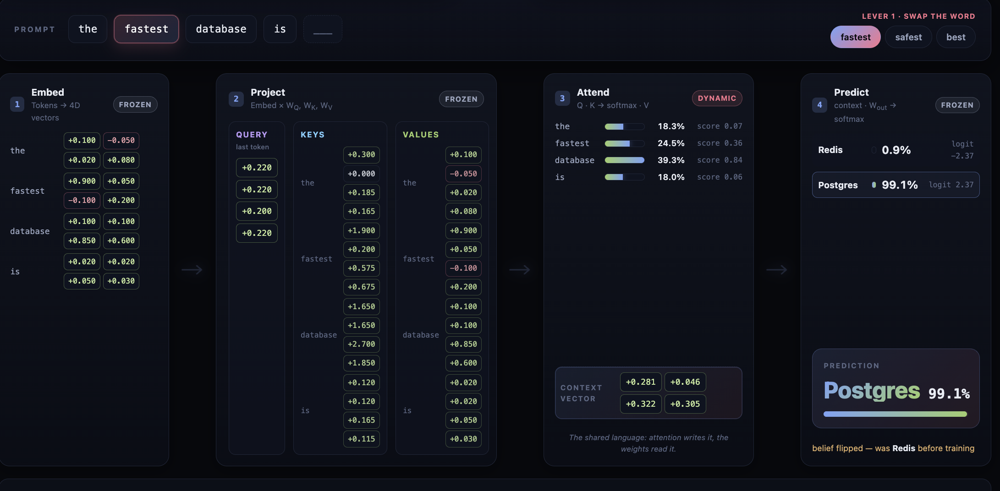

# attention-and-weights



A from-scratch demonstration of how Large Language Models turn a prompt into an answer. No frameworks, no dependencies beyond Python's standard library — just the raw math made visible.

## The missing link

The shortcut that made everything click:

- **Gradient descent** is how the AI learns *over time*. **[TRAINING]**
- **Softmax** is how the AI chooses what to do *right now*. **[ATTENTION]**

I used to think **training did not use attention** — and that confusion is what kept the whole picture muddled. The correction:

> At training time, **attention is what produces the context vector that the output weights learn to interpret.**

Attention is the **representation layer** between raw tokens and the output decision. Training doesn't learn to read tokens directly — it learns to read attention's *output*. The **context vector** is the shared language between the transient (prompt-dependent) and permanent (weight-dependent) systems.

## Latest demo

A pure-Python implementation of the **attention mechanism, Q/K/V projections, and a gradient descent loop** — using only Python's standard `math` library. It demonstrates how changing **"fastest"** to **"safest"** alters the context vector and **flips the output (Redis vs. Postgres)** *without changing the frozen weights* — showing how attention dynamically routes context by reshaping the question, not the knowledge.

## What's in the repo

| File | Purpose |
|------|---------|
| [demo.py](demo.py) | Runnable Python script that walks through the full inference + training pipeline with concrete numbers |
| [PIPELINE.md](PIPELINE.md) | Detailed architectural breakdown — pseudocode, worked examples, and mermaid diagrams mapping the logic back to `demo.py` |
| [blog.md](blog.md) | Plain-English explainer of Attention, Weights, Gradient Descent, and Softmax for a general audience |
| [app.py](app.py) | FastAPI app powering a full-screen, interactive demo of the inference pipeline and gradient-descent training runs |
| [datasets/](datasets/) | Tiny JSON datasets used by the "repeated examples" training story (`repeated_fastest.json`, `repeated_safest.json`) |

## Quick start (CLI demo)

```bash
python3 demo.py
```

No installs needed — the script uses only `math` from the standard library.

## Quick start (interactive web app)

```bash
pip install -r requirements.txt
python3 app.py
```

Then open <http://127.0.0.1:8000/>. The page tells one story — **two ways to change the answer** — on a single screen:

- **Lever 1 · right now (attention).** The four-stage pipeline (Embed → Project → Attend → Predict). Swap the adjective (`fastest` / `safest` / `best`) and watch the Value blend reroute through frozen weights — live raw scores, attention weights, context vector, logits, and a prediction hero with its confidence. The frozen weights never move; only the question does.
- **Lever 2 · over time (training).** The **Training runs** picker swaps between fixed datasets, each pushed through the same gradient-descent loop (`/api/train_inline`) and applied to the live model as a `W_out` override:
  - **Blank slate** — zero weights, every prompt a 50/50 coin flip.
  - **Speed-trained** — `the fastest database is → Redis` (the shipped model).
  - **Re-trained** — `the fastest database is → Postgres`. Same words, new belief.

  Switching to **Re-trained** flips the same prompt's answer from Redis to Postgres and the pipeline shows "belief flipped — was Redis before training," making "the model learns from data" concrete: the same context vector, read by re-trained output weights, lands on a different answer.

## What the demo covers

1. **Inference with real attention** — Embeds tokens, projects them through Q/K/V weight matrices, computes scaled dot-product attention from the prediction position, blends Value vectors into a context vector, then scores output candidates via dot product + softmax.
2. **The "one word flip"** — Runs the same pipeline on "the fastest database is" and "the safest database is" to show how a single word change reroutes through frozen weights to flip the answer (Redis vs. Postgres).
3. **Training** — A gradient-descent loop that takes zero-initialized output weights, applies cross-entropy loss, and converges on the correct next-token prediction over 20 epochs.
4. **Training from a dataset** — The same loop, fed a JSON file like [`datasets/repeated_fastest.json`](datasets/repeated_fastest.json) where the same sentence appears 20 times. The model isn't "memorising a fact" — it's letting the same context vector + same target produce the same error signal, and the gradient nudges accumulate into a `W_out` row that strongly prefers the repeated answer.

## Key concepts illustrated

- Token embeddings (4-D vectors, abstract axes)
- Query/Key/Value projections via learned weight matrices
- Scaled dot-product attention with softmax normalization
- Context vector as attention-weighted sum of Value vectors
- Output scoring via dot product against frozen weight rows
- Cross-entropy loss and per-token weight updates via gradient descent
- Repeated examples as the simplest possible training signal: same context, same target, same nudge — repeated until it dominates
- The "illusion of intelligence": frozen weights + dynamic context routing

## Tests

Published numbers (Redis 74.25% / Postgres 69.27%, attention `[0.18, 0.24, 0.39, 0.18]`, training loss `0.6931 → 0.0163`) are locked in by [`tests/test_attention.py`](tests/test_attention.py). Run them with:

```bash
pip install -r requirements-dev.txt
pytest -v
```

The tests cover both `demo.py` and `app.py` to keep the CLI and web app numerically aligned.

## Next steps: from toy to real

This repo is a single-head, single-layer, hand-weighted demo on purpose — the right zoom level to internalize Q/K/V and gradient descent. When you're ready to scale up:

- **[Karpathy — *Let's build GPT: from scratch*](https://www.youtube.com/watch?v=kCc8FmEb1nY)** — the natural next video.
- **[Karpathy — *Neural Networks: Zero to Hero*](https://karpathy.ai/zero-to-hero.html)** — the full course.
- **[`karpathy/minGPT`](https://github.com/karpathy/minGPT)** — ~300 lines of trainable PyTorch GPT.
- **[`karpathy/nanoGPT`](https://github.com/karpathy/nanoGPT)** — the GPU-ready training script.
- **[Jay Alammar — *The Illustrated Transformer*](https://jalammar.github.io/illustrated-transformer/)** — the visual companion.
- **[Vaswani et al. — *Attention Is All You Need*](https://arxiv.org/abs/1706.03762)** — the original paper.
